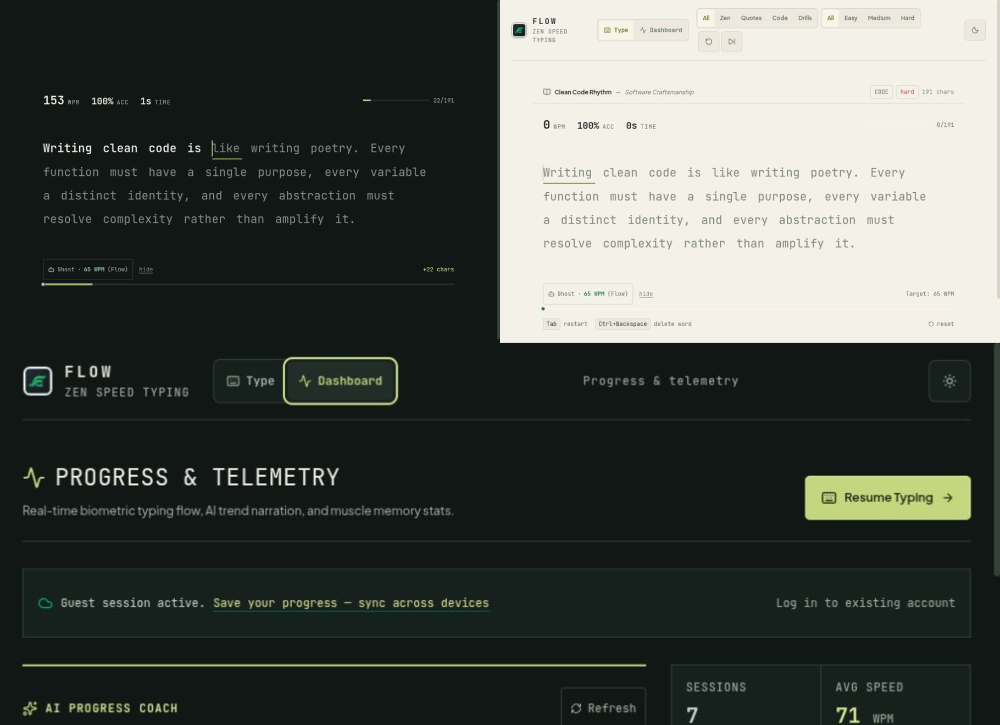

# Flow — quiet precision typing practice

Flow is a focused typing practice workspace for daily repetition. The showcase
above demonstrates the two tuned themes and the progress dashboard.

Features:

- distraction-free passage typing with WPM, accuracy, time, caret, and active-word breathline feedback;
- optional Ghost Racer pacing instrument with adjustable opponent speed;
- completion analysis with weakness detection and targeted AI drills;
- adaptive local-first practice queue that deduplicates weak spots and falls back to targeted drills offline;
- accessible practice settings for reading rhythm, Zen timing, Ghost pace, passage length, goals, and optional focus sounds;
- validated custom passages for plain text or code, saved locally with title, source, and difficulty metadata;
- daily minutes goals, optional WPM/accuracy targets, quiet streaks, and compact completion updates;
- bounded replay analysis with segment-level pause/error inspection;
- progression dashboard with coach narration, KPIs, speed chart, weakness drills, and session history;
- persisted light/dark theme toggle with system preference fallback and keyboard-accessible controls;
- installable production app shell with versioned static caching and network-only API requests.

## Development

This template provides a minimal setup to get React working in Vite with HMR and some Oxlint rules.

Currently, two official plugins are available:

- [@vitejs/plugin-react](https://github.com/vitejs/vite-plugin-react/blob/main/packages/plugin-react) uses [Oxc](https://oxc.rs)
- [@vitejs/plugin-react-swc](https://github.com/vitejs/vite-plugin-react/blob/main/packages/plugin-react-swc) uses [SWC](https://swc.rs/)

## React Compiler

The React Compiler is not enabled on this template because of its impact on dev & build performances. To add it, see [this documentation](https://react.dev/learn/react-compiler/installation).

## Expanding the Oxlint configuration

If you are developing a production application, we recommend using TypeScript with type-aware lint rules enabled. Check out the [TS template](https://github.com/vitejs/vite/tree/main/packages/create-vite/template-react-ts) for information on how to integrate TypeScript and Oxlint's TypeScript related rules in your project.
